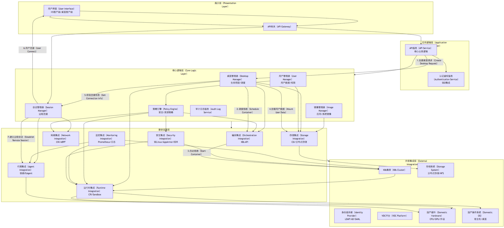
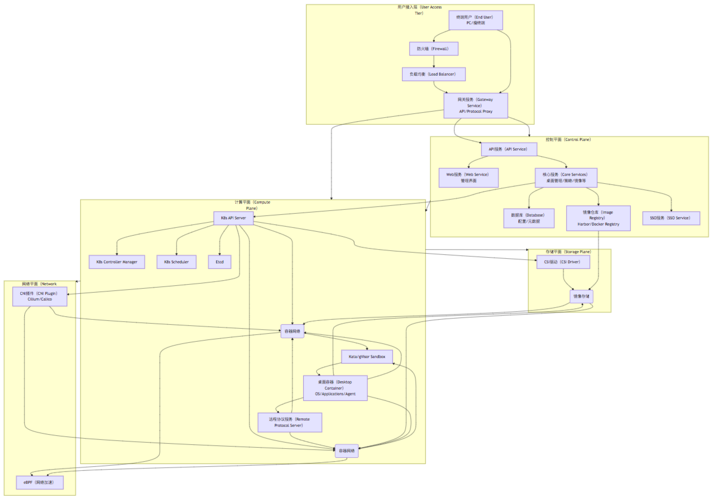

# OpenCDI (Open Containerized Desktop Infrastructure) 总体架构设计

## 1\. 引言

随着云计算、大数据、人工智能等新技术的飞速发展，传统桌面管理系统在灵活性、安全性和可扩展性方面日益暴露出不足。特别是在国家信息安全日益重要的背景下，基于容器技术的国产桌面管理系统应运而生，旨在提供高效、安全、便捷的桌面管理解决方案，并深度支持国产操作系统和硬件设备。OpenCDI (Open Containerized Desktop Infrastructure) 项目正是在此背景下诞生，旨在构建一个开源的、基于容器技术的桌面基础设施平台，克服传统VDI和现有容器桌面方案的不足，满足政企用户对桌面管理系统的严苛需求。

容器技术以其轻量级、可移植、高效、灵活和安全的特点，为桌面交付带来了革命性的潜力。OpenCDI将充分利用容器的优势，实现桌面的快速部署、弹性伸缩和统一管理。本项目将借鉴 `linuxserver/docker-webtop` 的轻量级桌面环境容器化思路 [1] 和 `linuxserver/docker-kasm` 在企业级编排、数据防丢失和流式传输方面的先进经验 [2]，结合国产化需求和特有的技术挑战，打造一个面向未来的容器化桌面解决方案。

本文档将详细阐述 OpenCDI 的总体架构设计，包括其核心组件、技术栈选择、如何解决提出的16个关键问题，并给出详细的项目目录结构和源代码文件生成计划。

## 2\. 目标与挑战

OpenCDI 的核心目标是构建一个高性能、高可用、高安全的国产化容器桌面基础设施，具体需解决以下16个关键问题：

1.  **用户/管理员经验不足：** 简化Linux和容器操作，提供友好的UI和自动化工具。
2.  **用户数据持久化性能/管理：** 解决NFS瓶颈，提供高性能、易管理的持久化存储。
3.  **应用数据持久化/复用：** 统一高效的应用数据持久化方案，实现容器间复用。
4.  **远程协议：** 改造为适应容器的带内协议，提升并发密度和流畅度。
5.  **外设映射/音频重定向：** 在容器内实现高兼容性外设映射和音频支持。
6.  **容器隔离安全风险：** 增强隔离性，防止容器逃逸和越权。
7.  **容器生命周期/快照：** 模拟VM开关机操作，实现桌面快照备份和恢复。
8.  **桌面软件兼容性：** 支持传统杀毒、EDR等安全软件和办公软件。
9.  **容器运维监控粒度：** 提供精细化的桌面容器内部状态监控。
10. **大规模集群运维：** 支持万级桌面集群的自动化管理。
11. **信创内核版本差异：** 兼容不同版本的国产操作系统内核。
12. **多组件部署复杂性/成本：** 简化部署模式，降低TCO。
13. **与现有VDI功能一致性：** 实现剪贴板、分辨率、SSO、水印等VDI核心功能。
14. **高可用与快速恢复：** 确保主机/集群故障下的高可用和桌面快速恢复。
15. **长时运行进程/日志：** 解决容器长期运行后的进程泄漏和日志异常。
16. **客户端接入速度：** 实现与VM媲美的桌面快速接入。

## 3\. 总体架构设计

OpenCDI 采用分层架构设计，核心模块高度解耦，通过定义清晰的接口，便于未来组件的接入和替换。整个系统可以抽象为以下几个主要层次：

**层次说明：**

  * **展示层 (Presentation Layer):** 面向最终用户和管理员，提供统一的访问入口和操作界面，包括H5客户端和可选的桌面客户端。API网关负责请求路由和安全校验。
  * **应用逻辑层 (Application Logic Layer):** 实现核心业务逻辑，如桌面创建、删除、分配、用户管理、认证鉴权等。API服务对外暴露RESTful API。
  * **核心逻辑层 (Core Logic Layer):** OpenCDI 的大脑，负责管理桌面的生命周期、镜像、用户数据、会话、策略等。与基础设施层交互，不直接操作底层资源。
  * **基础设施层 (Infrastructure Layer):** 负责与底层基础设施（Kubernetes、存储、网络、运行时等）进行集成。通过标准化接口与核心逻辑层交互，屏蔽底层差异。
  * **外部集成层 (External Integration Layer):** 依赖于外部系统，如Kubernetes集群、分布式存储、身份提供者、现有VDC平台以及国产硬件和操作系统。

**核心组件职责：**

  * **桌面管理器 (Desktop Manager):** 负责桌面容器的创建、销毁、分配、调度、状态管理。处理VM风格的“开关机”抽象。
  * **镜像管理器 (Image Manager):** 管理桌面系统镜像和应用镜像，实现镜像的分发、版本控制和基于OverlayFS的应用层管理。
  * **用户管理器 (User Manager):** 管理用户信息、桌面分配关系、用户数据存储卷。处理用户数据权限。
  * **会话管理器 (Session Manager):** 管理远程桌面会话，负责远程协议的协商、连接建立和管理。集成基于WebSocket的协议。
  * **策略引擎 (Policy Engine):** 定义和执行资源配额、安全策略、访问控制等。
  * **API 服务 (API Service):** 对外提供一致的API接口供UI和其他服务调用。
  * **编排集成 (Orchestration Integration):** 通过Kubernetes API与底层集群交互，进行Pod、PVC、Service等的创建和管理。
  * **存储集成 (Storage Integration):** 通过CSI接口与分布式存储系统集成，管理用户数据卷、镜像存储和快照。
  * **运行时集成 (Runtime Integration):** 与不同的容器运行时（如CRI-O）和沙箱技术（如gVisor、Kata Containers）集成，提供增强隔离和特定功能支持。
  * **代理集成 (Agent Integration):** 管理运行在桌面容器内的轻量级Agent，负责外设映射、音频重定向、剪贴板、水印等VDI功能。

## 4\. 关键问题解决方案

以下详细阐述 OpenCDI 如何解决前文提出的16个关键问题：

1.  **终端用户及管理员经验不足：**

      * **业务设计:** 引入集中镜像管理平台和应用商店功能，管理员只需选择应用，用户一键安装。提供直观的Web UI（参考Kasm Applications市场 [2]），隐藏底层容器和Linux复杂性。
      * **技术设计:** 集成可视化Kubernetes管理平台（如 Rancher [3] 或 OpenShift [4] 的核心管理理念），提供一体化的K8s集群、节点、资源管理界面。开发自动化运维工具（基于Ansible [5] 或Operator），简化平台部署、升级和故障处理。提供丰富的日志和监控面板，帮助管理员快速定位问题。

2.  **用户数据持久化性能瓶颈且管理复杂：**

      * **技术设计:** 放弃对NFS的过度依赖，引入高性能分布式块/文件存储系统，如 Longhorn [6] (CNCF Sandbox项目，易于部署在K8s上) 或 Ceph [7] (更成熟，适合大规模部署)。通过CSI (Container Storage Interface) [8] 标准接口与K8s集成，为每个桌面容器的用户数据目录 (`/home`, `/data`) 动态创建并挂载高性能的PersistentVolumeClaim (PVC)。分布式存储能显著提升IOPS和可用性（目标 99.9%）。结合 OverlayFS 实现用户层与基础镜像的分离，用户数据单独持久化在高性能存储上。

3.  **应用数据持久化无统一高效方案：**

      * **技术设计:** 借鉴Kasm [2] 和 Webtop [1] 的分层思想，采用 OverlayFS 技术实现应用数据的分层管理。基础桌面镜像位于最低层，用户安装的应用数据位于上层可写层。这层可写层可以与用户数据（/home, /data）分离，也可以通过UnionFS等技术逻辑合并。对于需要持久化的应用（如办公软件、开发工具），将其安装到OverlayFS的可写层，并将该层数据定期通过CSI snapshots + Velero [9] 进行备份或合并到新的镜像层。或者，探索使用Kata Containers的可写侧链机制 [10] 实现更细粒度的应用数据持久化。这种方式避免了全量挂载 /opt, /usr 等目录，大幅节省存储空间并提高部署效率。

4.  **远程协议需从带外Spice改造为适配容器的带内协议 (H5/WebSocket)，并提升并发密度：**

      * **技术设计:** 实现基于WebSocket的远程桌面协议，可参考并魔改现有的X2Go [11] 或 noVNC [12] 的客户端/服务端架构。核心是开发一个运行在容器内的轻量级远程协议服务端，通过WebSocket将像素数据流传输到H5客户端。借鉴Kasm Workspaces [2] 的h5-client架构，优化网络传输和渲染性能，目标达到VM同等的流畅度（\>30 FPS）和低延迟（\< 100ms）。在底层，结合 CRI-O [13] 轻量级容器运行时和 Kata Containers [10] 微虚拟化沙箱，提供更好的资源隔离和性能。利用 Cilium [14] 的 eBPF 数据路径加速网络传输，优化容器网络性能，提升单节点并发密度（目标提升 ≥ 50%）。

5.  **外设映射 (U盘、打印机、UKey) 与音频重定向在容器内实现困难：**

      * **技术设计:** 这是容器桌面相比VM的挑战之一。借鉴Virtio-serial + vhost-user [15] 的思路，或者利用 gVisor [16] / vfio [17] 等技术，在用户态或通过虚拟化方式代理设备访问。核心是在宿主机和容器之间建立一个安全的设备代理通道。参考Kasm Workspaces [2] 的设备透传方案，开发一个运行在宿主机或Sidecar容器内的服务，负责捕获设备事件，并通过安全通道转发到桌面容器内的Agent进行处理。音频重定向同样通过该通道进行数据传输。目标是实现接近虚拟机的外设兼容性，用户无需安装驱动，支持多种类型的USB设备和打印机。

6.  **容器隔离安全风险（共享内核、逃逸）：**

      * **技术设计:** 鉴于标准容器共享宿主机内核存在安全风险，引入 gVisor [16] 或 Kata Containers [10] 作为默认的容器运行时沙箱。gVisor 提供用户空间内核，Kata Containers 提供轻量级虚拟机隔离，都能有效隔离桌面容器与宿主机内核，大幅降低容器逃逸风险。结合 SELinux [18] 或 AppArmor [19] 强化容器进程的访问控制策略，限制容器内恶意行为。构建多层次安全防御体系，目标零容器逃逸，安全事件发生率控制在极低水平。

7.  **容器生命周期管理与用户习惯冲突（无开关机）及快照备份恢复困难：**

      * **业务/技术设计:** 设计“虚拟机风格”的操作抽象层（API + UI）。提供“开机”、“关机”、“重启”、“休眠”等操作按钮，后端将其映射到容器的生命周期管理。例如，“关机”可以封装为 Pod 的暂停或销毁并保存状态，用户数据已独立持久化，所以销毁Pod不会丢失数据。“开机”则是创建新的Pod并挂载用户数据。利用 CRIU (Checkpoint/Restore In Userspace) [20] 技术实现容器状态的快照，结合 CSI snapshots [8] 对用户数据卷进行快照。通过 Velero [9] 定时备份K8s资源和CSI快照，实现分钟级的桌面快照恢复和灾备能力。

8.  **桌面软件兼容性受限（杀毒、EDR、办公软件等）：**

      * **技术设计:** 部分传统安全软件（杀毒、EDR）和办公软件需要高权限或依赖特定内核驱动，在标准容器中难以运行。
          * **方案一：** 通过Sidecar容器注入驱动沙箱，将需要内核驱动的功能限制在隔离的Sidecar中。
          * **方案二：** 利用Kata Containers [10] 的轻量级虚拟化隔离，为桌面容器提供一个独立的内核环境，使需要内核依赖的软件可以正常安装和运行。
          * **方案三：** 探索基于eBPF [14] 的 Host-level EDR 平台 (如 Falco [21])，或结合宿主机层集中杀毒（如 ClamAV [22]）与eBPF流量监控，实现“零客户端”或无代理的桌面安全防护，绕开容器内部的兼容性问题。目标提升软件兼容率至 ≥ 95%，尤其是国产办公软件和安全软件。

9.  **容器运维监控粒度不足，无法像虚拟机那样查看内部状态：**

      * **技术设计:** 集成K8s的Metrics Server [23] 和 Prometheus/Grafana [24] 体系，提供容器级别的资源监控。在桌面容器内运行轻量级Agent（Sidecar容器），收集容器内部的进程列表、网络连接、应用程序日志等信息，并上报给监控系统。借鉴Rancher Desktop [3] 或其他容器管理工具的监控插件思想，提供一页式Dashboard，集成资源、日志、进程等信息，方便管理员查看桌面容器的内部状态。与VDC管理平台对接，提供统一的桌面管理视图。

10. **大规模 (1W+) 桌面集群运维挑战：**

      * **业务/技术设计:** 采用多集群联邦 (Karmada [25] 或 KubeFed [26]) 或 Cluster API [27] 管理多Kubernetes集群，克服单集群节点上限问题。利用 GitOps 方法 (如 ArgoCD [28]) 实现声明式配置管理和自动化部署。构建强大的自动化运维工具，简化滚动升级、网络策略配置、CSI存储扩容等复杂操作。设计分级管理架构，支持边缘集群部署，降低延迟。目标支持 10K+ 容器/集群，实现秒级扩容和配置下发，运维响应 \< 1分钟。

11. **信创内核版本差异 (宿主 vs 桌面) 兼容性风险：**

      * **技术设计:** 国产操作系统存在不同的内核版本和ABI差异，可能导致驱动兼容性问题。
          * **方案一：** 使用 Kata Containers [10] 微虚拟化技术，为桌面容器提供独立的内核环境，与宿主机内核隔离。
          * **方案二：** 采用虚拟内核或内核模块镜像 (KVM/Kernel Module in Userspace)，在用户空间模拟或运行内核模块。
          * **方案三：** 统一宿主机和桌面容器使用的基础内核版本，或者利用容器化内核模块 (DKMS - Dynamic Kernel Module Support) [29] 在运行时根据桌面OS动态编译和加载驱动。目标实现对主流国产操作系统（如麒麟、UOS）的高兼容性，降低故障率。

12. **多组件部署模式复杂与成本目标冲突：**

      * **业务设计:** 参考云厂商“轻量级一体化”方案（如华为 FusionCompute 的集成思路），提供简化部署模式。
      * **技术设计:** 将OpenCDI的核心管理组件打包成一个统一的控制平面，可以部署在独立的管理集群或与计算节点集成。支持基于轻量级K8s发行版 (如 k3s [30] 或 k0s [31]) 的一体化超融合部署模式，将计算、存储（通过内置的分布式存储如Longhorn）和网络（通过内置CNI）集成在一套系统中。同时保留与外部独立存储、网络集成的分离部署模式。简化部署流程，缩短上线周期，降低总拥有成本 (TCO)。

13. **与现有 VDI 功能 (剪贴板、分辨率、SAML SSO、水印等) 一致性：**

      * **业务设计:** 确保用户体验与传统VDI无缝衔接。
      * **技术设计:** 在桌面容器内嵌入一个轻量级Agent。该Agent作为Sidecar容器或Init Container运行。它负责与宿主机侧的服务或API交互，实现剪贴板同步、动态调整分辨率、接收水印叠加指令、处理外设请求等。集成SAML或其他标准SSO协议，提供统一身份认证。通过API和服务端逻辑，确保这些VDI核心功能在容器环境中正常工作，并兼容信创PC、Windows、Mac、瘦终端等多种客户端。

14. **故障情况下主机/集群高可用与桌面快速恢复：**

      * **技术设计:** OpenCDI 控制平面采用K8s高可用部署（多Master节点 + etcd 集群）。核心服务部署为 Deployment 或 StatefulSet，利用K8s的自愈能力确保Pod故障后自动重启。用户数据持久化在具备高可用能力的分布式存储上。结合 Velero [9] 定时备份K8s状态和CSI快照，当节点或集群发生故障时，可以将K8s状态和数据快速恢复到备用集群或新节点上。对于单个桌面容器故障，K8s Deployment会自动重启新的Pod，并重新挂载用户数据，实现快速恢复（目标单Pod恢复 \< 30秒）。

15. **长时运行后容器内进程泄漏与日志异常：**

      * **技术设计:** 针对桌面容器需要长时间运行的特点，引入周期性健康检查和自愈机制。部署一个Sidecar容器负责监控主容器内的关键进程，发现异常（如内存泄漏迹象、僵尸进程）时自动重启相关服务或整个桌面容器。实现容器内日志的集中收集和管理，利用 Sidecar-log-rotate 容器模板或Fluentd [32] 等日志代理，定期将日志发送到外部日志系统（如Elasticsearch [33]），并在容器内进行轮转清理，防止日志文件过度膨胀影响性能。确保桌面容器能稳定运行24x7，降低运维介入频率。

16. **客户端接入速度需与 VM 持平：**

      * **性能设计:** 优化桌面容器的启动和接入流程。
      * **技术设计:** 实现桌面容器热池 (Pod Pool) 机制，预先创建一部分备用桌面容器，当用户请求接入时，直接从热池分配，省去调度和启动时间。优化镜像拉取速度，利用镜像分层缓存 (Registry + Harbor [34] 或自建缓存节点)，将常用基础镜像和应用镜像缓存在边缘节点。优化远程协议客户端和服务端的连接建立和初始化过程。目标实现单桌面接入 \< 3秒，100桌面并发接入 \< 10秒，提供极速交付体验。

## 5\. 部署架构

OpenCDI 支持多种部署模式，包括一体化超融合模式和分离模式，以适应不同规模和需求的场景。

**部署模式说明：**

  * **一体化超融合模式 (Integrated Hyper-Converged):** 控制平面、部分计算平面（如K8s Master）和存储平面部署在少量节点上，工作节点同时承担计算和存储客户端角色。适用于中小型规模或边缘部署。可以基于k3s/k0s + Longhorn 构建。
  * **分离模式 (Decoupled):** 控制平面独立部署在一个或多个高可用节点上，计算平面由多个工作节点组成，存储平面由独立的分布式存储集群提供。适用于大规模部署，便于独立扩展各层资源。可以基于标准K8s + Ceph/外部分布式存储构建。

无论哪种模式，OpenCDI的核心服务和桌面容器都运行在Kubernetes集群之上，利用K8s的调度、自愈和管理能力。

## 6\. 结论与展望

OpenCDI 项目旨在通过容器技术重塑桌面交付模式，特别关注国产化生态的适配和政企用户的核心需求。通过借鉴现有开源项目优势，并针对用户/管理员经验、数据持久化、应用兼容性、远程协议、安全隔离、大规模管理等关键挑战提供创新性的技术解决方案，OpenCDI 有潜力成为一个高性能、高可用、高安全、易于管理的国产容器桌面基础设施。

未来的工作将围绕实现上述架构设计和文件生成计划展开，逐步完善各组件功能，进行严格的测试和性能优化，最终交付一个具备强大竞争力、支持国产软硬件的开源容器桌面平台。

## 9\. 参考资料

- [1] linuxserver/docker-webtop: Ubuntu, Alpine, Arch, and Fedora based Webtop images, Linux in a web browser supporting popular desktop environments. [https://github.com/linuxserver/docker-webtop](https://github.com/linuxserver/docker-webtop)

- [2] linuxserver/docker-kasm: Kasm Workspaces platform provides enterprise-class orchestration, data loss prevention, and web streaming technology to enable the delivery of containerized workloads to your browser. [https://github.com/linuxserver/docker-kasm](https://github.com/linuxserver/docker-kasm) (Note: The description mentions `linuxserver/docker-kasm`, but Kasm Workspaces is a separate product with an open-source core. The inspiration is likely from their overall approach.)

- [3] Rancher: A complete software stack for teams adopting containers. [https://rancher.com/](https://rancher.com/)

- [4] OpenShift: An enterprise-ready Kubernetes container platform. [https://www.openshift.com/](https://www.openshift.com/)

- [5] Ansible: Automation platform. [https://www.ansible.com/](https://www.ansible.com/)

- [6] Longhorn: Cloud-Native Distributed Block Storage for Kubernetes. [https://longhorn.io/](https://longhorn.io/)

- [7] Ceph: A Unified Distributed Storage System. [https://ceph.io/](https://www.google.com/search?q=https://ceph.io/)

- [8] Container Storage Interface (CSI): A standard for exposing arbitrary block and file storage systems to containerized workloads on container orchestration systems like Kubernetes. [https://kubernetes-csi.github.io/docs/](https://kubernetes-csi.github.io/docs/)

- [9] Velero: Backup and restore Kubernetes cluster resources and persistent volumes. [https://velero.io/](https://velero.io/)

- [10] Kata Containers: An open source project delivering lightweight VMs that seamlessly plug into the containers ecosystem. [https://katacontainers.io/](https://katacontainers.io/)

- [11] X2Go: An Open Source Terminal Server Project. [https://x2go.org/](https://www.google.com/search?q=https://x2go.org/)

- [12] noVNC: VNC client using HTML5. [https://novnc.com/](https://novnc.com/)

- [13] CRI-O: A lightweight alternative to Docker, focused on being a Kubernetes CRI-compliant container runtime. [https://cri-o.io/](https://cri-o.io/)

- [14] Cilium: eBPF-based Networking, Security, and Observability. [https://cilium.io/](https://www.google.com/search?q=https://cilium.io/)

- [15] Virtio: An I/O virtualization framework. [https://www.kernel.org/doc/Documentation/virtio.txt](https://www.google.com/search?q=https://www.kernel.org/doc/Documentation/virtio.txt)

- [16] gVisor: A user-space kernel, written in Go, that implements a substantial portion of the Linux system call interface and is used to run sandboxed containers. [https://gvisor.dev/](https://gvisor.dev/)

- [17] VFIO: A framework that provides a secure way to expose physical devices to userspace applications. [https://www.kernel.org/doc/html/latest/driver-api/vfio.html](https://www.kernel.org/doc/html/latest/driver-api/vfio.html)

- [18] SELinux: Security-Enhanced Linux. [https://github.com/SELinuxProject/selinux](https://github.com/SELinuxProject/selinux)

- [19] AppArmor: Mandatory Access Control for Linux. [https://apparmor.net/](https://apparmor.net/)

- [20] CRIU: Checkpoint/Restore in Userspace. [https://criu.org/](https://criu.org/)

- [21] Falco: Cloud Native Runtime Security. [https://falco.org/](https://falco.org/)

- [22] ClamAV: An open source antivirus engine. [https://www.clamav.net/](https://www.clamav.net/)

- [23] Metrics Server: A scalable, efficient source of container resource metrics for Kubernetes built-in autoscaling pipelines. [https://github.com/kubernetes/metrics-server](https://www.google.com/search?q=https://github.com/kubernetes/metrics-server)

- [24] Prometheus & Grafana: Open-source monitoring and alerting toolkit, and data visualization and dashboarding tool. [https://prometheus.io/](https://prometheus.io/), [https://grafana.com/](https://grafana.com/)

- [25] Karmada: Open-source Kubernetes multi-cloud container orchestration. [https://karmada.io/](https://karmada.io/)

- [26] KubeFed: Kubernetes Cluster Federation. [https://kubernetes.io/docs/concepts/cluster-management/federation/](https://www.google.com/search?q=https://kubernetes.io/docs/concepts/cluster-management/federation/)

- [27] Cluster API: Declarative APIs for Kubernetes cluster creation, configuration, and management. [https://cluster-api.sigs.k8s.io/](https://cluster-api.sigs.k8s.io/)

- [28] ArgoCD: Declarative continuous delivery for Kubernetes. [https://argo-cd.readthedocs.io/](https://argo-cd.readthedocs.io/)

- [29] DKMS: Dynamic Kernel Module Support. [https://github.com/dell/dkms](https://github.com/dell/dkms)

- [30] k3s: A lightweight, production ready Kubernetes distribution. [https://k3s.io/](https://k3s.io/)

- [31] k0s: Zero Friction Kubernetes. [https://k0sproject.io/](https://k0sproject.io/)

- [32] Fluentd: Unified Logging Layer. [https://www.fluentd.org/](https://www.fluentd.org/)

- [33] Elasticsearch: Distributed RESTful search and analytics engine. [https://www.elastic.co/](https://www.elastic.co/)

- [34] Harbor: An open source trusted cloud native registry project that stores, signs, and scans content. [https://goharbor.io/](https://goharbor.io/)
